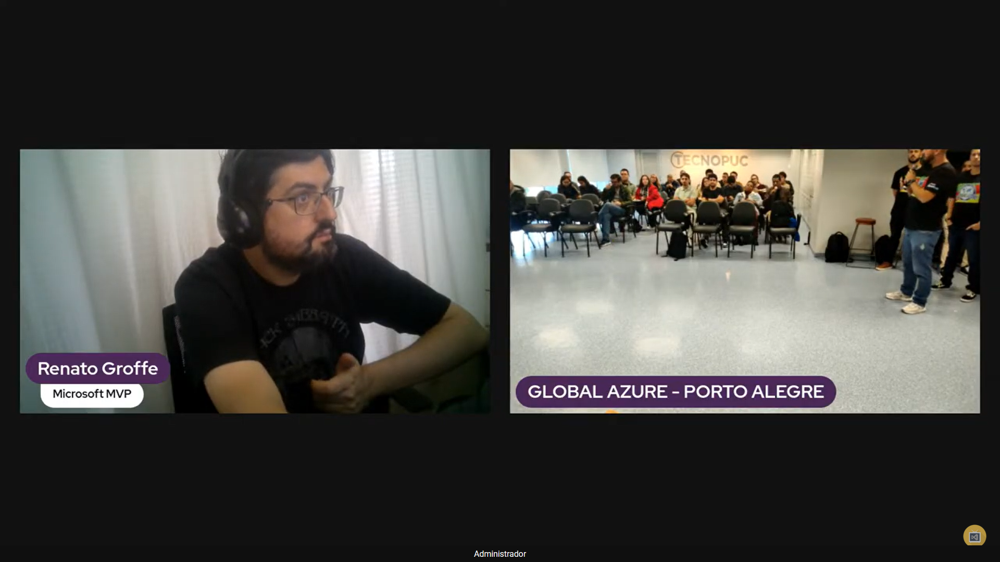
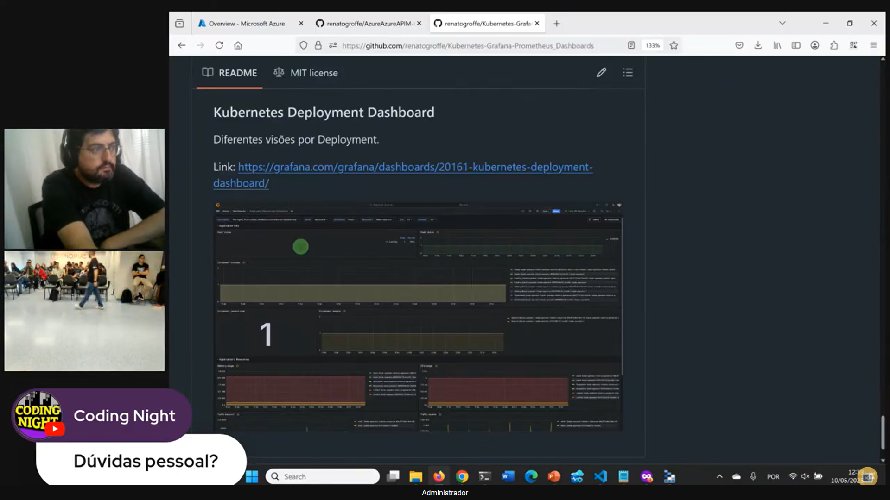
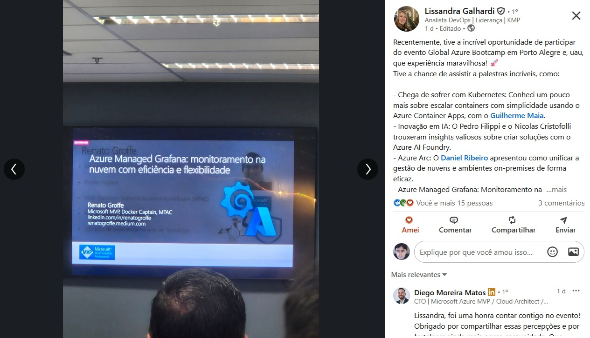
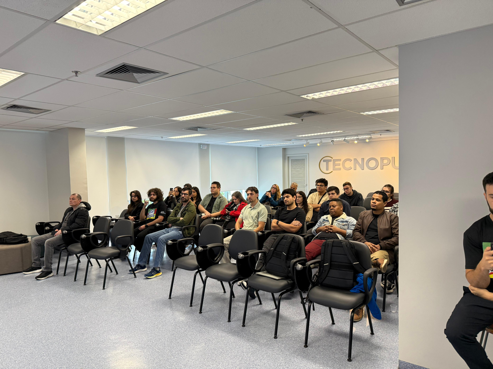

# AzureGrafana_GlobalAzure2025-PortoAlegre
Conteúdos de apresentação sobre Azure Managed Grafana realizada em 10/05/2025, durante a edição 2025 do Global Azure em Porto Alegre-RS.

Artigos que produzi sobre o uso do Grafana com o Microsoft Azure e que foram publicados no blog AzureBrasil.cloud:
- [Por que utilizar o Grafana no monitoramento de recursos do Azure?](https://www.azurebrasil.cloud/grafana-monitoramento-azure/)
- [Grafana + Observabilidade de APIs no Azure: conhecendo o dashboard para o API Management](https://www.azurebrasil.cloud/grafana-azure-api-management/)
- [Grafana + Azure Kubernetes Service: observabilidade e monitoramento de ambientes containerizados](https://www.azurebrasil.cloud/grafana-azure-kubernetes-service/)
- [Grafana + Azure Container Apps: observabilidade e monitoramento de aplicações containerizadas](https://www.azurebrasil.cloud/grafana-azure-container-apps/)

---

## Informações sobre o evento

Título da apresentação: **Azure Managed Grafana: monitoramento na nuvem com eficiência e flexibilidade**

Data: **10/05/2025 (sábado)**

Tecnologias e tópicos abordados: **Grafana, Azure Managed Grafana, Azure Kubernetes Service, Prometheus, Kubernetes, Docker, Azure Storage, Azure API Management, Azure Monitor, Application Insights, Log Analytics, Linux, Azure VMs, Cloud Native, Observabilidade, DevOps...**

Número de participantes: **35 pessoas**

Gravação da apresentação: [**YouTube**](https://www.youtube.com/watch?v=K83iVaYxYn8)

